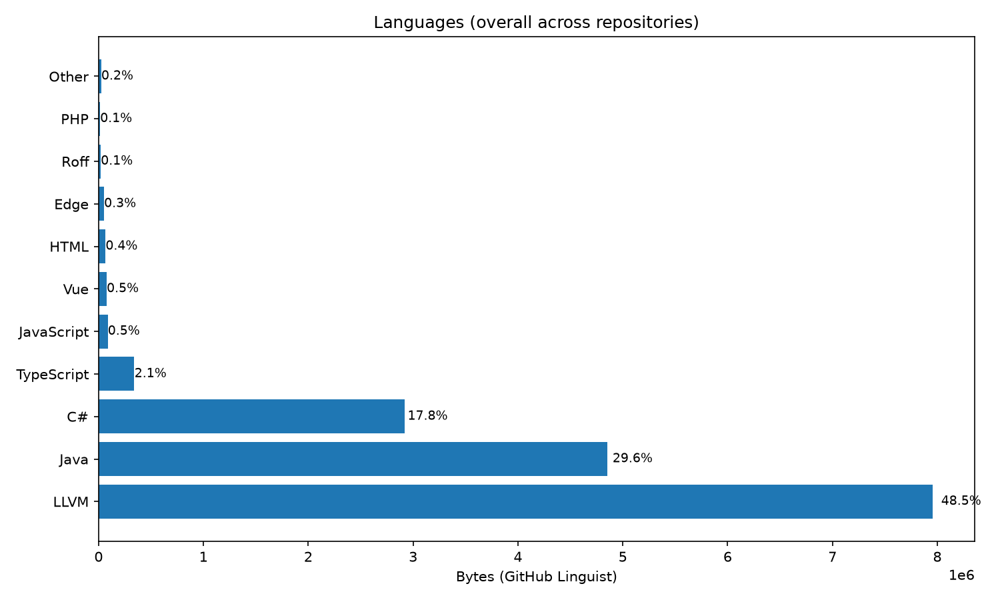

# 👋 Hello there, I'm DevStackJunior

## 🚀 Currently Learning & Building
I am currently focused on cloud architecture and scaling applications.
### ☁️ Cloud & Infrastructure
* **Azure Cloud Migration:** Transitioning projects from local setups to **Azure Cloud Environments**.
* **Infrastructure:** Orchestrating services to ensure seamless deployment and scalability.
* **Security:** Implementing **Private Endpoints** for secure backend connectivity.
### 🧪 Test-Driven Mindset (TDD)
I am refining my "Test-First" approach to build more resilient software:
* **Failure-Driven Development:** Writing failing tests first to strictly define features and avoid over-engineering.
* **Contract-First Design:** Designing service interfaces and APIs from the consumer's perspective before implementation.
* **Edge Case Anticipation:** Mapping data validation and error boundaries (e.g., malformed API payloads) before writing logic.

---

<h2 align="center">💻 My Tech Stack :</h2>

  

---

## 📂 Featured Projects

| Project | Stack | Description |
| :--- | :--- | :--- |
| **Flashcards Fullstack** | `Vue.js` • `AdonisJS` | A full-stack learning platform with a robust REST API. |
| **Flashcards MAUI** | `.NET` • `MAUI` | Cross-platform mobile application for quick revisions. |
| **SnakeJS** | `JavaScript` | A classic Snake game logic implemented for the console. |

---

## 📊 GitHub Stats

  

---

## 📫 Let's Connect
* **GitHub:** [@devstackjunior](https://github.com/devstackjunior)
